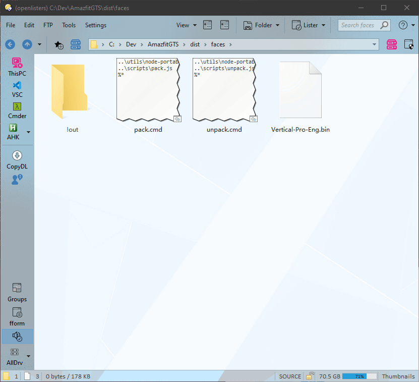
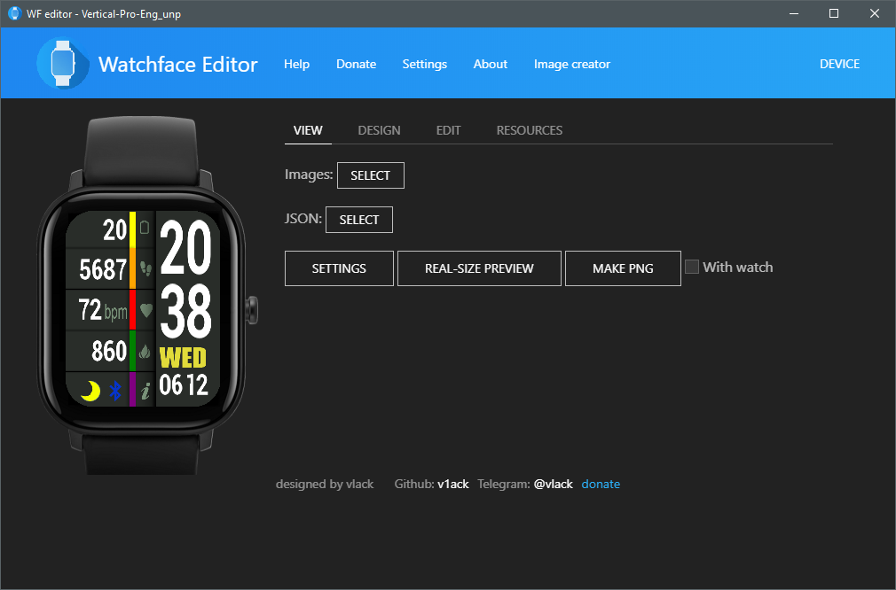
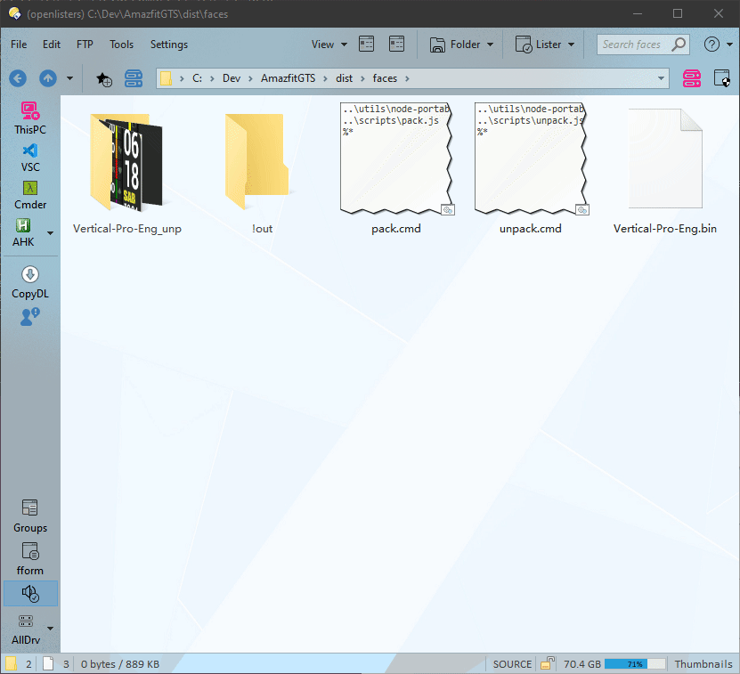
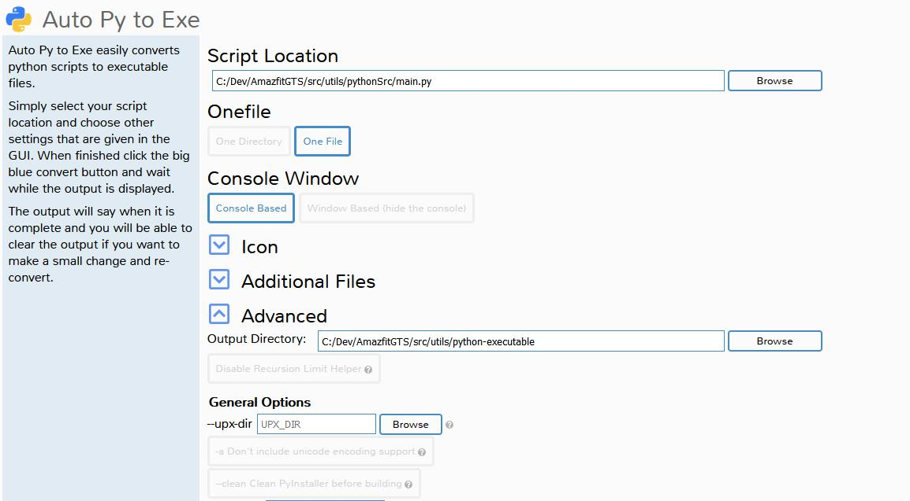
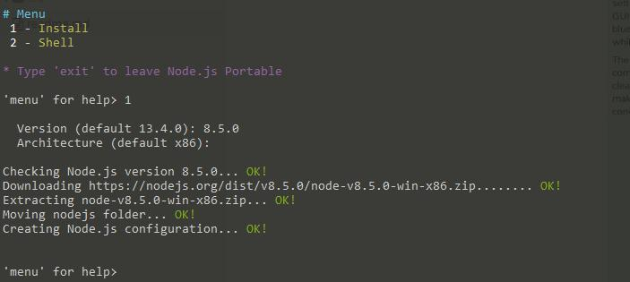

# Amazfit GTS watchface edit bundle

Tools for editing watchfaces are all over the place.

This here is bundle with simple workflow so we can focus on actual creative process.

**Note: I am not an author of these tools. I have just compiled it into single bundle, added custom scripts to automate the process and modified a little so it can be used with GTS. Authors (as to my knowladge) are named below**

The bundle includes

* decompiler / compiler and compress / decompress utility from https://telegram.me/GizChinaIt

  * you can get it on telegram by contacting @IlGruppoTesterBot

* watchfaceEditor (forked from https://github.com/v1ack/watchfaceEditor) packed as desktop electron app and with experimental support for GTS watchfaces
  * if you want just editor here is [separate repo](https://github.com/chm-dev/watchfaceEditor)
* scripts and folder structure / workflow for easy and efficient work

Please note, however - I rushed this thing asap and bugs are certain. Also using nodejs-portable for something that probably should be just bat files is probably bad, but when I thought about all those filenames and path transformations that are taking place, I really didn't want to lose three days over this.

Complete, compiled and ready to use package is in releases, but you can build it yourself for the most part, if you want.
Instructions are below.

## How to use
0. Download bundle from releases tab or by [clicking here](https://github.com/chm-dev/GTS-watchface-bundle/releases/download/firstRelease/GTS-watchface-bundle.zip).

1.  Unzip it wherever you want.

2.  Get some bins to work with: ie https://amazfitwatchfaces.com/gts/ and put them inside the folder `/faces` next to files `pack.cmd`, `unpack.cmd` and `!out` folder.

3.  To unpack bin file just drag it onto unpack.cmd file:



4.  Next go to `/utils/GTS-watchfaceeditor-x64` and start `watchfaceeditor.exe`

5.  From the upper right menu Device select Amazfit GTS.

6.  Locate your unpacked watchface and load images and JSON accordingly.

Once loaded it should look like so:



7.  Edit watchface as usual.
8.  When done, save JSON and all the assets and pack it all back to bin by dragging directory with watchface files onto `pack.cmd`:



9.  Your watchface and images (both animated gif and static png) are in `!out` folder

# Building

Project consists of 3 elements.

Decompiler created in python, my scripts in nodejs and watchface editor.

These instructions will result in making self-contained bundle, just as one in releases.

### Python watchface decompiler:

Init your virtualenv if you want:

```powershell
$ virtualenv.exe -p /Python37/python.exe .\buildEnv
```

Activate it:

```powershell
$ .\buildEnv\Scripts\activate.bat
```

Install pillow for image handling

```powershell
$ pip install Pillow
```

Install auto-py-to-exe

```powershell
(buildEnv) $ pip install auto-py-to-exe
```

Start it with `autopytoexe.exe` (which should be in your path already) and your browser should open gui.
Create single file executable from python project at:

`\src\utils\pythonSrc\`

and compile it to

`\src\utils\python-executable\`

It should look something like this:



Once done you should have main.exe in python-executable folder.

### Nodejs-portable setup.

> You can skip this step if you have nodejs already installed and in %path%, but .cmd files will need amendments.

I decided to put nodejs-portable compiled executable, but original repository is here if you want to compile it yourself:

https://github.com/crazy-max/nodejs-portable

Run `nodejs-portable.exe` in `\src\utils\node-portable` and when prompted select Install.

You can select older version of node to keep the size low as the scripts are using basic node libs.



And you are ready to go.

If you want watchfaceEditor you can grab it from here: https://github.com/chm-dev/watchfaceEditor or clone this repository with with submodule:

```powershell
$ git clone --recurse-submodules https://github.com/chm-dev/GTS-watchface-bundle.git
```
